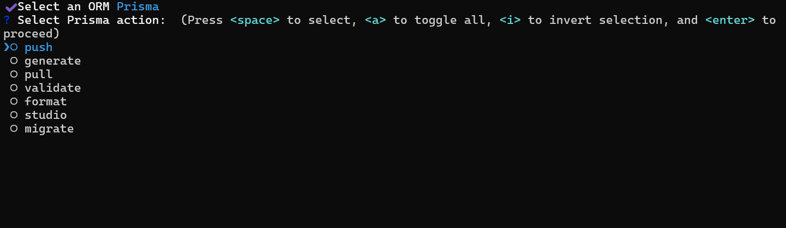

# ormz

A CLI tool for managing ORM commands with auto-detection and interactive menus for Prisma and Drizzle.



## Installation

```bash
bun install
```

## Usage

```bash
bun run index.ts
```

The tool automatically detects your ORM configuration and provides interactive menus for common commands.

## Supported ORMs

**Prisma**: push, generate, pull, validate, format, studio, migrate commands

**Drizzle**: generate, migrate, push, pull, studio

## Auto-Detection

- Detects `drizzle.config.*` files for Drizzle
- Detects `schema.prisma` files for Prisma  
- Prompts for selection if both/neither found

## License

MIT

Built with [Bun](https://bun.sh)
